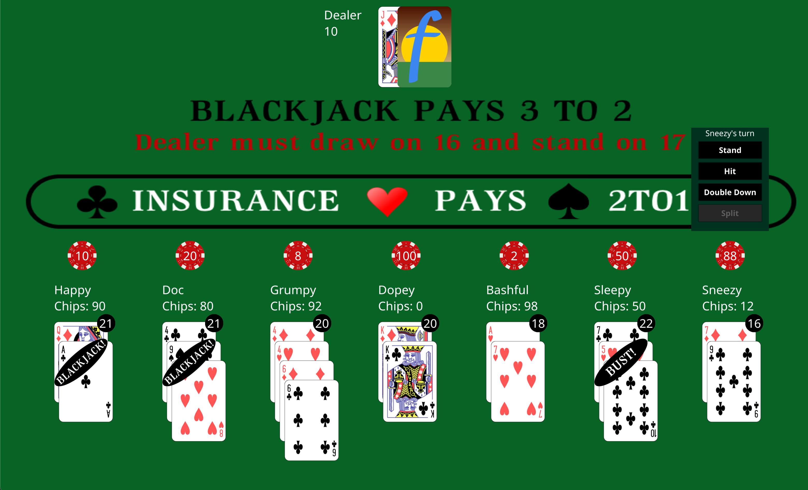

# Blackjack

### A blackjack card game built with Go and Fyne toolkit
&nbsp;

This game was made as a project to refine my knowledge of Go and explore the Fyne toolkit for building a GUI on top of Go. The game supports up to 7 players.

&nbsp;

## Screenshot

## Upcoming features:
* Split
* Ability to remove players from table before next deal
* Animations