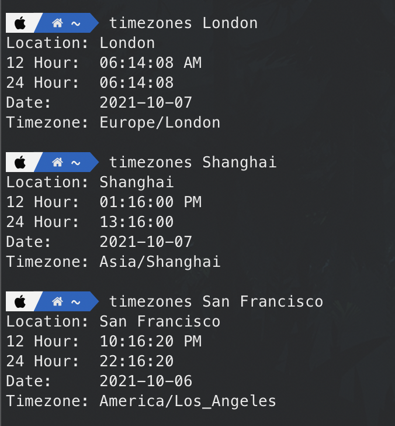

# Timezones

Timezones is a basic Go app that allows for quickly looking up the time in another city right from your terminal! No more having to search Google for the answer ;)



## Setup
Timezones pulls timezone informatin from the free API at [ipgeolocation.io](https://ipgeolocation.io/timezone-api.html). <br>
To use this free API, you must first register an account at [https://ipgeolocation.io/signup.html](https://ipgeolocation.io/signup.html)<p>

Once registered, go to your account dashboard and copy the API Key and enter it on line 38 of the main.go file.

`apiKey := "{{YourApiKeyGoesHere}}"`

Save your changes.

## Building the app

*If you do not already have Go Language installed, you can find instructions here: [https://golang.org/doc/install](https://golang.org/doc/install)*

* Change directories to the directory timezones was cloned/downloaded

	`cd ~/Timezones`

* Build the Go app. Use `-o` to give the app a custom name

	`go build -o timezones main.go`
	
This creates the executable in the same directory as the source code. Move the executable to a location within your $PATH variable so that you can launch the application from any location in your terminal

ℹ️ *Alternatively, you can name the app* `tz` *if you're lazy like me and want to type as little as possible to get the information you want!*

## Usage
Timezones is simple by design. Just type the name of app and the city you want to lookup the time for:

`$ timezones new york`

This outputs the following:

```
Location: New York
12 Hour:  02:02:53 AM
24 Hour:  02:02:53
Date:     2021-10-07
Timezone: America/New_York
```

Here is an example of naming the app `tz`:

`$ tz cork`

Output:

```
Location: Cork
12 Hour:  07:25:09 AM
24 Hour:  07:25:09
Date:     2021-10-07
Timezone: Europe/Dublin
```
